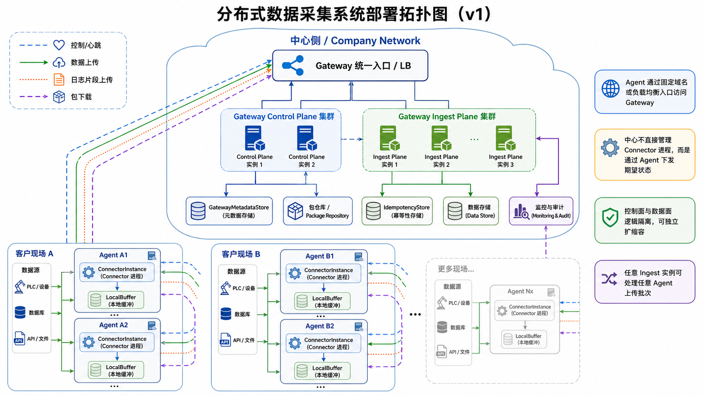
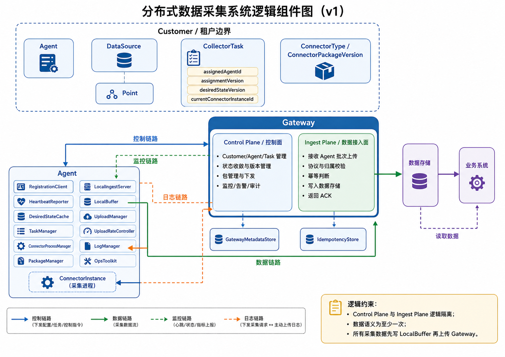
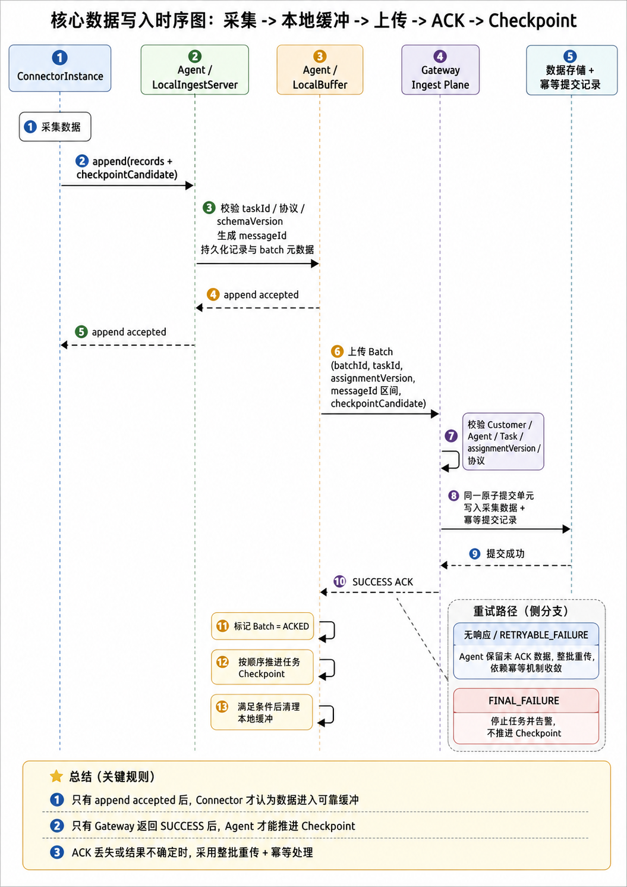

# 分布式数据采集系统逻辑架构方案

## 版本记录

| 版本 | 日期 | 说明 |
|------|------|------|
| v0.1 | 2026-04-29 | 建立第一版逻辑架构骨架，明确 Customer、Gateway、Agent、CollectorTask、ConnectorInstance、LocalBuffer、至少一次语义和第一版边界。 |
| v0.2 | 2026-04-29 | 根据两份 v0.1 评审补强对象模型、状态收敛、可靠性原子性、批次与 ACK、Gateway HA、LocalBuffer、安全、运维和版本兼容规则。 |
| v0.3 | 2026-04-29 | 补充工业过程点高频采集容量基线、本地二进制流缓存模型、Gateway 接入吞吐目标和 Agent 上传削峰填谷策略。 |
| v0.4 | 2026-04-29 | 根据 v0.3 评审补强幂等索引可行性、writeSeq/messageId 关系、全局 catch-up 协调、元数据一致性、监控聚合和运维边界。 |
| v0.5 | 2026-04-29 | 冻结数据写入、幂等记录、ACK、Checkpoint 的一致性方案，明确 batch 级 checkpointCandidate 契约，并将真实 payload 校准列为数据面详细设计门禁。 |
| v0.6 | 2026-04-29 | 根据 v0.5 Web 评审补齐架构图索引、接口契约、状态机转移、数据产品边界、备份恢复、时间语义、ConnectorType 能力、运维处置、验收矩阵和部署前提。 |
| v0.7 | 2026-05-19 | 根据 v0.6 审查补齐 storageStreamId 定义、ENABLED→DISABLED 直接跳转处置语义、observed version 精确定义和收敛判断两步机制、BatchState 终态补充、catch-up lease 基本属性、GatewayMetadataStore 读己之写选型门禁和大白话版版本对应声明。 |

## 1. 设计目标

本系统用于统一管理部署在客户现场的采集节点，通过中心侧 `Gateway` 对客户现场 `Agent` 进行纳管、配置下发、程序包下发、任务启停、运行监控和数据接入，最终将采集数据写入中心数据存储，供业务系统使用。

第一版设计目标是：

- 支持多个客户，每个客户可部署多个 `Agent`。
- 每个 `Agent` 可运行多个 `ConnectorInstance`。
- `Gateway` 作为统一入口，内部拆分为控制面和数据接入面。
- `Agent` 负责客户现场执行、Connector 生命周期管理、本地可靠缓冲和恢复上传。
- 数据链路采用 `至少一次` 语义，允许重复，尽最大可能避免静默丢失。
- 面向工业过程点采集场景，第一版容量基线按少量高密度 Agent 设计，而不是大量低密度 Agent 设计。
- 第一版不实现自动动态分发、严格 exactly-once、批次内断点续传和自动任务迁移，但为后续演进预留模型能力。

本方案是逻辑架构设计，不替代详细设计。涉及容量数值、具体协议实现、存储产品选型和运维部署参数时，本文只定义必须满足的逻辑约束和决策点，不凭空给出未经业务确认的数值。

## 2. 总体逻辑架构

系统整体由以下核心逻辑域组成：

- `Customer`：系统一级租户边界，用于划分客户、Agent、任务、数据、权限、资源配额和监控视图。
- `Gateway`：公司内部中心服务，对外作为统一入口，内部逻辑拆分为控制面和数据接入面。
- `Agent`：部署在客户现场的独立服务器，负责本客户现场 Connector 生命周期管理、本地数据缓冲、状态上报和数据上传。
- `Connector`：实际执行数据采集的程序。不同类型 Connector 对应不同程序包，同一程序包可按任务启动多个实例。
- `LocalBuffer`：Agent 本地可靠缓冲，承接 Connector 采集结果并支持断网、重启和 Gateway 短暂不可用时的恢复上传。
- `GatewayMetadataStore`：中心侧元数据存储，保存 Customer、Agent、任务、分配关系、版本、Checkpoint、审计和包注册表等控制面数据。
- `IdempotencyStore`：中心侧幂等记录存储，保存数据接入时用于重复识别的幂等键和必要摘要。
- `数据存储`：中心侧采集数据持久化存储，保存 Gateway 接入后的业务数据。
- `业务系统`：从数据存储读取数据，不直接依赖 Agent 或 Connector。

系统核心链路为：

```text
控制链路：Gateway Control Plane -> Agent -> ConnectorInstance
数据链路：ConnectorInstance -> Agent LocalBuffer -> Gateway Ingest Plane -> 数据存储
监控链路：Agent -> Gateway Control Plane
日志链路：Gateway 下发采集请求 -> Agent 主动上传日志片段
```

v0.6 补充三张架构评审视图，用于帮助后续详细设计、开发拆分、测试验收和运维交接统一理解：

- 部署拓扑图：
- 逻辑组件图：
- 核心写入时序图：

上述图片是逻辑架构视图，不替代详细设计中的 API schema、部署清单、DDL、文件格式和运维 SOP。若图片与正文文字冲突，以正文约束为准；图片需要随正文版本同步更新。

第一版中，`Gateway Control Plane` 与 `Gateway Ingest Plane` 可以物理同进程部署，但逻辑上必须隔离：

- 独立 API 边界。
- 独立鉴权和错误码。
- 独立限流和熔断。
- 独立监控指标。
- 支持后续拆成独立服务和独立扩缩容。

控制面是低频、强治理链路，风险主要是配置错误、权限错误和状态不一致。数据接入面是高频、大流量链路，风险主要是吞吐瓶颈、存储失败、重试风暴和租户间资源争用。两者不能在逻辑上混为一个不可拆分模块。

## 3. 核心对象模型

系统核心对象关系调整为：

```text
Customer
├── Agent
├── DataSource
│   └── Point
├── CollectorTask
│   ├── assignedAgentId
│   ├── assignmentVersion
│   ├── desiredStateVersion
│   └── currentConnectorInstanceId
└── ConnectorType / ConnectorPackageVersion
```

`Customer` 是客户租户对象，是数据隔离、权限隔离、资源配额和任务归属的一级边界。

`Agent` 属于某个 `Customer`，表示客户现场的一台受管采集节点。

`DataSource` 表示被采集的数据源或源端访问点。它用于承载数据源地址、数据源类型、连通性、凭证引用和权限审计。多个 `CollectorTask` 可以引用同一个 `DataSource`。

`Point` 表示工业过程点、测点或传感器点位。一个 `DataSource` 可以包含多个 `Point`。高密度工业采集场景下，不能把每个 Point 建模为一个 CollectorTask，否则任务、状态、日志、Checkpoint 和 Gateway 元数据都会膨胀。

`CollectorTask` 是最小控制单元，表示“一个数据源引用或设备组 + 一套采集配置 + 一个 ConnectorType + 一个任务配置版本”。任务属于 `Customer`，通过 `assignedAgentId` 分配给某个 Agent，而不是 Agent 的强子对象。一个 CollectorTask 可以覆盖一个 DataSource 下的一组 Point。

`ConnectorInstance` 是任务在 Agent 上的实际运行实例。第一版采用 `1 CollectorTask : 1 ConnectorInstance`。

`ConnectorType` 表示采集器类型，例如 `mysql-binlog`、`http-polling`、`file-tail`。

`ConnectorPackageVersion` 表示某个 `ConnectorType` 的具体程序包版本，例如 `mysql-binlog:1.3.2`。

`TaskConfigVersion` 表示任务采集配置版本，与程序包版本分离。

`LocalBuffer` 是 Agent 本地可靠缓冲组件。所有采集数据必须先进入本地缓冲，再上传 Gateway。

这种模型避免把 `CollectorTask` 绑定死在某个 Agent 下，为后续手动迁移、自动调度、Agent 替换和故障恢复保留空间。

## 4. Gateway 逻辑职责

Gateway 对外是统一入口，内部按控制面和数据接入面拆分。

控制面职责：

- Customer 管理和租户隔离。
- Agent 注册、审批、发现、禁用和状态管理。
- DataSource 管理、连通性检测和凭证引用管理。
- CollectorTask 创建、分配、启停和配置版本管理。
- ConnectorType、ConnectorPackageVersion 管理、版本管理和下发。
- 维护任务期望状态、分配关系、assignmentVersion、desiredStateVersion、TaskConfigVersion 和 ConnectorPackageVersion。
- Agent、Task、ConnectorInstance、LocalBuffer 监控汇总。
- 告警、审计、运维视图。
- 为后续动态分发预留调度能力。

数据接入面职责：

- 接收 Agent 上传的数据批次。
- 校验 Customer、Agent、Task、assignmentVersion 和任务归属关系。
- 校验批次协议、数据 Envelope 和记录协议版本。
- 基于幂等键识别重复数据。
- 保证采集数据写入与幂等记录写入的一致性边界。
- 写入数据存储。
- 返回明确 ACK。

Gateway HA 原则：

- 控制面和数据接入面均应按无状态服务设计。
- 状态保存在 `GatewayMetadataStore`、`IdempotencyStore` 和数据存储中。
- Agent 通过固定域名或负载均衡入口访问 Gateway。
- 任意 Ingest 实例应能处理任意 Agent 的上传批次。
- Gateway 实例故障不应导致已持久化元数据或幂等状态丢失。
- 数据面过载不能拖垮控制面，至少要通过独立限流、线程池、连接池或进程隔离实现保护。

`GatewayMetadataStore` 和 `IdempotencyStore` 可以在物理实现上共用数据库或存储集群，但逻辑上必须区分职责。数据存储用于业务采集数据，不应混淆为 Gateway 控制面元数据的唯一建模位置。

GatewayMetadataStore 一致性约束：

- Customer、Agent、CollectorTask、assignmentVersion、desiredStateVersion、TaskConfigVersion 和 ConnectorPackageVersion 的更新必须在同一元数据事务或等价原子提交单元内完成。
- assignmentVersion 和 desiredStateVersion 必须通过单调递增版本或 CAS / 乐观锁更新，禁止并发写覆盖。
- Gateway 控制面读取任务期望状态时必须满足读己之写；同一控制操作完成后，后续读取不得返回旧版本。
- Agent 上报的 observed version 被 Gateway 接收后，Gateway 后续状态判断不得读取到早于该 observed version 对应的任务版本。
- 多 Gateway 实例部署时，控制面实例之间可以通过共享强一致元数据存储、主写节点或等价机制保证上述约束。
- 第一版不承诺跨数据中心强一致灾备；同一部署单元内元数据存储的 RPO 应为 `0`，RTO 由底层存储和运维部署保证。

v0.7 选型门禁：GatewayMetadataStore 的存储选型必须证明满足"读己之写"语义。可接受方案包括主库读写、同数据库会话内读写、线性化读或等价机制。如果选用的存储默认不提供读己之写（如 eventual consistency 的副本读取），则必须在 Gateway 控制面实现版本缓存、session stickiness 或强制主库读，不得默认使用副本读。该约束属于详细设计门禁，存储选型评估时必须明确回应。

IdempotencyStore HA 约束：

- 任意 Ingest 实例必须能查询和写入同一逻辑幂等空间。
- Ingest 实例故障后，其他实例必须能继续识别已成功写入但 ACK 可能丢失的批次或记录。
- 幂等状态丢失会破坏至少一次语义下的重复控制，第一版部署中 IdempotencyStore 不应使用单机易失存储。

## 5. Agent 逻辑职责

Agent 是客户现场自治执行节点和数据缓冲节点，职责包括：

- 向 Gateway 注册并维持心跳。
- 拉取或接收 Gateway 下发的任务期望状态。
- 持久化最近一次已确认的期望状态。
- 下载、校验和管理 ConnectorPackageVersion。
- 启动、停止、重启和监控 ConnectorInstance。
- 向 ConnectorInstance 暴露本地采集写入接口。
- 接收 ConnectorInstance 采集结果。
- 为记录生成 `messageId`。
- 将采集数据写入本地可靠缓冲。
- 按批次上传本地缓冲数据到 Gateway。
- 根据 Gateway ACK 更新批次状态。
- 在满足顺序和原子性条件后推进任务 Checkpoint。
- 上报资源、任务、实例、缓冲、日志和告警摘要。

Agent 内部逻辑组件包括：

- `RegistrationClient`：负责注册、凭证换取、凭证轮换和禁用状态处理。
- `HeartbeatReporter`：负责心跳、资源指标、状态摘要上报。
- `DesiredStateCache`：持久化最近一次已确认的任务期望状态和版本。
- `TaskManager`：负责任务期望状态收敛。
- `ConnectorProcessManager`：负责 ConnectorInstance 进程生命周期、运行目录和资源限制。
- `PackageManager`：负责程序包下载、哈希校验、签名校验和本地包仓库。
- `LocalIngestServer`：负责 ConnectorInstance 到 Agent 的本地提交协议。
- `LocalBuffer`：负责二进制流可靠写入、段文件、WAL、回放游标、修复和清理。
- `UploadManager`：负责批次上传、重试、退避、ACK 处理。
- `UploadRateController`：负责根据积压、Gateway 反馈和本地资源进行削峰填谷。
- `LogManager`：负责本地日志保留、摘要上报和按需日志片段上传。
- `OpsToolkit`：负责本地缓存统计、巡检、修复和基准测试工具。

Agent 是现场自治单元。Gateway 不直接管理 Connector 进程，而是通过 Agent 下发期望状态。Agent 重启且 Gateway 暂时不可用时，可以基于本地持久化的期望状态恢复已确认的 ENABLED 任务，但必须标记为 `DEGRADED`，并在 Gateway 恢复后进行状态对账。对于包、配置或权限无法本地校验的任务，Agent 不应启动。

第一版不实现 Agent 自动升级。Gateway 仅记录 Agent 版本、最低兼容版本和升级告警；Agent 升级由人工或外部运维系统完成。

## 6. Agent 与 ConnectorInstance 本地提交协议

ConnectorInstance 不直接写 LocalBuffer，也不直接持有 Gateway 凭证。

ConnectorInstance 必须通过 Agent 提供的本地采集写入接口提交数据：

```text
ConnectorInstance -> Agent: append records + batch checkpointCandidate
Agent -> ConnectorInstance: append accepted / rejected
```

本地提交规则：

- Agent 必须校验 `taskId`、`connectorInstanceId`、协议版本、schemaVersion 和任务归属。
- Agent 为每条记录生成稳定 `messageId`。
- Agent 将记录、messageId、batch 级 checkpointCandidate 和必要元数据持久化到 LocalBuffer。
- 只有 Agent 返回 `append accepted` 后，ConnectorInstance 才能认为该批记录已经进入可靠缓冲。
- ConnectorInstance 如果维护源端游标，只能将随 append 批次提交的 `checkpointCandidate` 视为候选值，最终任务级 Checkpoint 仍由 Agent 在 Gateway SUCCESS ACK 后推进。
- Agent 在写入 LocalBuffer 前崩溃时，ConnectorInstance 不得把该批记录视为可靠采集完成。

本地通信可以采用本地 HTTP、gRPC、Unix Domain Socket、SDK 或其他实现方式。逻辑架构不强制具体协议，但必须满足以上提交语义。

## 7. 任务、实例与分配模型

第一版执行模型固定为：

```text
1 CollectorTask : 1 ConnectorInstance
```

一个 CollectorTask 表示一个 DataSource 引用和一套采集配置。一个任务在同一时刻只能分配给一个 Agent，并由该 Agent 上的一个 ConnectorInstance 执行。

工业过程点采集场景中，一个 CollectorTask 可以覆盖多个 Point。Point 是任务内部采集单元，不是第一版控制面最小启停单元。Point 级别的启停、过滤或独立迁移不属于第一版范围。

启停、重试、配置变更、审计均以 CollectorTask 为主粒度。

监控采用三层视图：

- 任务级监控：关注采集是否正常、Checkpoint 是否推进、上传是否滞后。
- 实例级监控：关注进程是否存活、资源占用、重启次数和运行错误。
- 分配级监控：关注 assignmentVersion、assignedAgentId、observedAssignmentVersion 是否收敛。

第一版不允许多个 Agent 同时执行同一个 CollectorTask。后续迁移必须通过 assignmentVersion 和迁移状态显式表达，不能通过并发执行隐式完成。

## 8. 状态模型与收敛协议

系统采用期望状态、任务运行状态、实例状态和背压状态分离的方式。

`DesiredState` 表示 Gateway 对任务的期望：

- `ENABLED`：任务应运行并继续采集。
- `DRAINING`：停止采集新数据，但继续上传 LocalBuffer 中的未 ACK 数据。
- `DISABLED`：任务不应运行；已存在未 ACK 数据仍不得被删除，除非满足清理条件。

`TaskRuntimeState` 表示任务分配与执行层面的状态：

- `UNASSIGNED`
- `ASSIGNED`
- `DEPLOYING`
- `RUNNING`
- `DRAINING`
- `STOPPED`
- `FAILED`

`InstanceState` 表示 ConnectorInstance 进程状态：

- `CREATED`
- `STARTING`
- `RUNNING`
- `THROTTLED`
- `PAUSED`
- `STOPPING`
- `EXITED`
- `CRASHED`

`BackpressureState` 表示 LocalBuffer 和资源压力状态：

- `NORMAL`
- `HIGH`
- `CRITICAL`
- `FULL`
- `ERROR`

状态收敛规则：

- Gateway 持有 `DesiredState`、`assignedAgentId`、`assignmentVersion`、`desiredStateVersion`、`TaskConfigVersion` 和 `ConnectorPackageVersion`。
- Agent 只执行版本最新且归属自身的任务指令。
- Agent 每次状态上报必须携带 `observedAssignmentVersion`、`observedDesiredStateVersion`、`observedTaskConfigVersion` 和 `observedPackageVersion`。
- Gateway 根据 observed version 判断 Agent 是否已经看到并执行最新期望状态。
- 旧版本指令不得覆盖新版本指令。

v0.7 明确 observed version 语义：

- `observed*Version` 的语义为：Agent 已将该版本持久化到 `DesiredStateCache` 并进入 `TaskManager` 处理。它表示"指令已送达并开始执行"，不是"已执行到目标状态"。
- Agent 收到新版本后，在本地持久化完成即可更新 observed version 上报，不需要等到 ConnectorInstance 进入 RUNNING。
- Gateway 侧的收敛判断必须分为两步：
  1. `observed*Version == latest`：指令已送达。如果此步超时，应告警并检查 Agent 连接状态。
  2. `TaskRuntimeState` 达到目标态（如 `RUNNING`、`STOPPED`、`DRAINING`）：收敛完成。如果此步超时，应告警并检查 Agent 日志、实例状态和本地资源。
- 超时阈值必须可配置，建议分为"指令送达超时"和"状态收敛超时"两档。
- 状态收敛超时后，Gateway 应标记任务为收敛异常并告警，不应无限静默重试。

典型风险场景：

```text
1. Gateway 下发 ENABLED v10。
2. 网络延迟。
3. Gateway 下发 DISABLED v11。
4. Agent 先收到 v11 并停止任务。
5. Agent 后收到 v10。
6. Agent 必须拒绝 v10，避免任务被错误重新启动。
```

因此，`assignmentVersion` 和 `desiredStateVersion` 不是仅为未来动态分发预留，第一版启停控制也必须使用。

状态机转移规则：

| 状态机 | 当前状态 | 目标状态 | 是否允许 | 触发方 / 说明 |
|--------|----------|----------|----------|---------------|
| DesiredState | DISABLED | ENABLED | 允许 | Gateway 控制面启动任务，提升 desiredStateVersion |
| DesiredState | ENABLED | DRAINING | 允许 | Gateway 控制面停止新采集但继续上传未 ACK 数据 |
| DesiredState | DRAINING | DISABLED | 允许 | 未 ACK 数据排空或人工确认风险后停用 |
|| DesiredState | ENABLED | DISABLED | 允许但不推荐直接跳转 | 语义上等价于立即 DRAINING 再排空后 DISABLED；Agent 必须立即停止 ConnectorInstance，但继续上传 LocalBuffer 中已有未 ACK 数据直到排空或人工干预；不推进 Checkpoint |
| DesiredState | DRAINING | ENABLED | 允许 | 取消停用，恢复采集 |
| TaskRuntimeState | UNASSIGNED | ASSIGNED | 允许 | Gateway 完成任务分配 |
| TaskRuntimeState | ASSIGNED | DEPLOYING | 允许 | Agent 已观察到最新 assignmentVersion 并开始部署 |
| TaskRuntimeState | DEPLOYING | RUNNING | 允许 | ConnectorInstance 启动成功 |
| TaskRuntimeState | RUNNING | DRAINING | 允许 | Agent 执行 DRAINING 期望状态 |
| TaskRuntimeState | DRAINING | STOPPED | 允许 | 采集停止且未 ACK 数据满足停用条件 |
| TaskRuntimeState | DEPLOYING / RUNNING | FAILED | 允许 | 启动失败、运行失败、协议错误或资源不可用 |
| TaskRuntimeState | FAILED | DEPLOYING / STOPPED | 允许但必须由 Gateway 指令或人工介入触发 | 禁止 Agent 静默无限自恢复 |
| InstanceState | CREATED | STARTING | 允许 | Agent 创建实例并启动进程 |
| InstanceState | STARTING | RUNNING | 允许 | ConnectorInstance 就绪 |
| InstanceState | RUNNING | THROTTLED / PAUSED | 允许 | 背压或运维指令触发 |
| InstanceState | RUNNING | STOPPING | 允许 | DRAINING、DISABLED、升级或人工停止 |
| InstanceState | STOPPING | EXITED | 允许 | 优雅退出或强制终止完成 |
| InstanceState | RUNNING | CRASHED | 允许 | Connector 进程异常退出 |
| InstanceState | CRASHED | STARTING | 允许但受自动重启次数限制 | 超过阈值后任务进入 FAILED |
| BatchState | PENDING | UPLOADING | 允许 | Agent UploadManager 发起上传 |
| BatchState | UPLOADING | ACKED | 允许 | Gateway 返回 SUCCESS |
| BatchState | UPLOADING | RETRY_WAIT | 允许 | 超时、无响应或 RETRYABLE_FAILURE |
| BatchState | RETRY_WAIT | UPLOADING | 允许 | 退避期结束后重传 |
|| BatchState | UPLOADING | FINAL_FAILED | 允许 | Gateway 返回 FINAL_FAILURE |
| BatchState | ACKED | PURGED | 允许 | Agent 确认本地缓冲数据已清理，Checkpoint 已推进且可清理条件全部满足 |
| BatchState | FINAL_FAILED | ABANDONED | 允许，需人工确认 | 人工确认风险后放弃该批次数据，保留审计记录 |

状态写入边界：

- DesiredState、assignmentVersion、desiredStateVersion、TaskConfigVersion 和 ConnectorPackageVersion 由 Gateway 控制面写入。
- TaskRuntimeState、InstanceState、BatchState 和 BackpressureState 的现场事实由 Agent 产生并上报。
- Gateway 可根据 Agent 上报推导观测态，但不得用推导态覆盖 Agent 本地可恢复状态。
- 高风险状态转移必须记录审计，包括任务启停、DRAINING、DISABLED、FAILED 人工恢复、Agent 禁用、程序包回滚和强制迁移。

## 9. 数据可靠性设计

第一版数据语义确定为：

```text
至少一次：允许重复，尽量不丢
```

数据流为：

```text
ConnectorInstance -> Agent LocalBuffer -> Gateway Ingest Plane -> 数据存储
```

处理流程：

1. ConnectorInstance 采集数据。
2. ConnectorInstance 调用 Agent 本地提交接口，提交记录和 batch 级 checkpointCandidate。
3. Agent 校验任务、实例和协议。
4. Agent 为记录生成 `messageId`。
5. Agent 将记录、messageId、batch 级 checkpointCandidate 和批次元数据写入 LocalBuffer。
6. Agent 返回 `append accepted`。
7. Agent 将 LocalBuffer 中的数据按批次上传到 Gateway。
8. Gateway 校验 Customer、Agent、Task、assignmentVersion 和数据协议。
9. Gateway 以幂等方式写入数据存储。
10. Gateway 返回批次 ACK。
11. Agent 收到 SUCCESS ACK 后标记批次完成。
12. Agent 在满足顺序推进条件后推进任务级 Checkpoint。
13. Agent 后续清理已确认本地缓冲数据。

关键原则：

- 数据写入 LocalBuffer 后，才算 Agent 侧接住数据。
- ConnectorInstance 收到 `append accepted` 后，才算该批记录进入可靠缓冲。
- Gateway 返回 SUCCESS 后，Agent 才能推进 Checkpoint。
- 未 ACK 数据必须保留在本地缓冲中。
- 第一版不做批次内断点续传，部分成功或结果不确定时采用整批重传。
- `RETRYABLE_FAILURE` 不代表没有写入，Agent 必须整批重传，Gateway 必须依赖幂等处理重复。
- Gateway 通过记录级幂等跳过已写成功记录。
- Gateway 只有在数据写入、幂等提交记录和批次提交状态处于同一原子提交单元并确认持久化后，才能返回 `SUCCESS`。
- 第一版数据面不采用“先写幂等记录、后异步写数据”或“先写数据、后异步补幂等记录”的松散方案。
- 数据存储如果无法提供同库事务、数据表唯一约束、原子 upsert / merge 或等价原子提交能力，则不能直接作为第一版主数据存储进入详细设计。

## 10. 数据 Envelope 与 Schema

Agent 上传到 Gateway 的每条记录必须带统一 Envelope。逻辑字段包括：

```json
{
  "customerId": "...",
  "agentId": "...",
  "taskId": "...",
  "connectorType": "...",
  "connectorInstanceId": "...",
  "assignmentVersion": 1,
  "messageId": "...",
  "eventTime": "...",
  "agentIngestTime": "...",
  "schemaVersion": "...",
  "payload": {}
}
```

要求：

- `customerId`、`agentId`、`taskId`、`messageId` 是数据接入的基础识别字段。
- `assignmentVersion` 用于避免旧 Owner 或旧分配关系继续上传。
- `schemaVersion` 用于表达 Connector 输出数据结构版本。
- Gateway 应记录 `gatewayIngestTime`，用于计算端到端延迟和排查积压。

数据 Schema 演进属于 ConnectorType 的一部分。ConnectorType 修改输出格式时，必须通过 `schemaVersion` 表达，不得在同一版本下改变不兼容语义。

v0.5 决策：系统级 `checkpointCandidate` 不再作为每条记录 Envelope 的必填字段。第一版唯一用于推进任务 Checkpoint 的候选值是 Batch 级 `checkpointCandidate`。如果某类 Connector 需要记录级源端游标来归并 Batch 候选值，这些游标只能作为 ConnectorType payload 内部字段或 Connector SDK 内部状态存在，不作为系统级 Checkpoint 推进契约。

工业过程点高频采集场景中，本地缓存和上传批次不应为每条样本重复存储完整 JSON Envelope。Envelope 是逻辑协议边界，物理传输可以采用批次级公共字段 + 样本级紧凑二进制 payload 的方式表达。样本 payload 中至少需要能表达 point 标识、采集时间、值、质量码或等价业务字段，具体编码由 ConnectorType 和 schemaVersion 定义。

## 11. Batch 模型

Batch 是 Agent 上传到 Gateway 的数据批次。

Batch 逻辑字段包括：

- `batchId`
- `customerId`
- `agentId`
- `taskId`
- `connectorInstanceId`
- `assignmentVersion`
- `recordCount`
- `byteSize`
- `firstMessageId`
- `lastMessageId`
- `checkpointCandidate`
- `batchSequence`
- `createdAt`
- `uploadAttempt`

`batchId` 由 Agent 生成，必须在同一 Agent 内稳定唯一。同一批次重传时 `batchId` 和记录 `messageId` 保持不变。

第一版为降低 Checkpoint 顺序推进复杂度，采用以下限制：

```text
同一 CollectorTask 同一时刻只允许一个上传中的 Batch。
```

该限制避免 Batch 2 先 ACK、Batch 1 后失败时错误推进 Checkpoint。后续如允许单任务并发上传，必须改为“连续 ACK 区间推进”模型。

Batch 状态：

- `PENDING`
- `UPLOADING`
- `ACKED`
- `RETRY_WAIT`
- `FINAL_FAILED`

Batch 大小限制必须配置化，至少包含：

- 单批最大记录数。
- 单批最大字节数。
- 单记录最大字节数。
- 单任务最大待上传批次数。

工业过程点高频采集场景的建议值：

- 本地写入批次按 `1s` 数据或最多 `10000` 条样本组织。
- 上传 Replay limit 默认 `50000` 条或 `4MB`，先到为准。
- 上传 Replay limit 最大 `100000` 条或 `8MB`，先到为准。
- 正常上传周期为 `1s - 5s`。
- 同一 CollectorTask 上传并发第一版仍为 `1`。
- 同一 Agent 上传 worker 默认 `2`，最大 `4`。

Batch 级 `checkpointCandidate` 规则：

- 每个 Batch 必须最多携带一个系统级 `checkpointCandidate`；该候选值覆盖该 Batch 内所有记录。
- Batch 内没有可推进游标时，`checkpointCandidate` 可以为空，但该 Batch 的 ACK 和清理仍必须按数据持久化结果处理。
- 同一 Batch 重传时，`checkpointCandidate` 必须保持不变；如果同一 `batchId` 对应不同候选值，Agent 或 Gateway 必须视为协议错误。
- Batch 的 `checkpointCandidate` 与 `firstMessageId`、`lastMessageId`、`recordCount`、`payloadDigest` 一起进入 LocalBuffer 批次元数据，用于崩溃恢复和重传一致性校验。

## 12. LocalBuffer 设计

工业过程点高频采集场景下，Agent 本地缓冲采用：

```text
二进制流 Segment + WAL + ReplayCursor
```

逻辑组件包括：

- `StorageEngine`：对 Agent 提供 `WriteBatch`、`Replay`、`Ack`、`Recover`、`Stats`。
- `RecordCodec`：将 Connector 提交的业务 payload 封装为二进制记录。
- `WALManager`：承担写前日志、checkpoint 和崩溃恢复。
- `SegmentManager`：负责顺序追加段文件、按大小滚动和段尾元数据。
- `ReplayManager`：按 `writeSeq` 顺序回放未上传数据。
- `RetentionManager`：清理已 ACK 且满足保留条件的段文件。
- `RecoveryManager`：负责启动扫描、尾部截断和 WAL 重放。
- `OpsToolkit`：提供 stats、verify、repair、benchmark 等本地运维工具。

主数据不应逐条写入 KV 存储。KV 或元数据文件只用于保存 cursor、checkpoint、manifest、统计和少量索引。第一版不建议使用 Kafka 作为每个 Agent 的本地缓冲，因为部署、运维和资源负担较重；也不建议用 RocksDB / Pebble 承载每条样本主体数据，除非后续 benchmark 证明 compaction 不影响读写目标。

记录与块模型：

- 每条记录至少包含 `eventTimeUnixMs`、`writeSeq`、`payloadLen`、校验信息和原始 payload。
- `writeSeq` 由本地存储系统生成，单进程内单调递增。
- 回放顺序以 `writeSeq` / 物理写入顺序为准，不依赖传感器时间绝对单调。
- Block 是最小完整写入和校验单元，默认 `1MB`。
- Block 可配置范围为 `256KB - 4MB`，第一版不把 `16MB` 级大块作为默认值。
- Segment 默认目标大小为 `256MB`，允许 `4MB` slack，避免最后一个完整 block 被截断。
- Segment 大小应可配置。高密度任务默认 `256MB`，低吞吐或任务数据量不均匀场景可降为 `64MB - 128MB`，以降低整段清理造成的空间滞留。
- 第一版清理粒度仍为整段文件，不做 Segment 内部删除或重写。需要更细粒度释放空间时，优先通过更小 Segment 和任务级 quota 控制。
- ReplayCursor 持久化在 LocalBuffer 元数据目录中，采用主文件 + 备份文件 + CRC + 原子替换。Cursor 每次 Ack 成功后必须持久化；cursor 损坏时可回退到备份或保守从最早未清理段重放。

LocalBuffer 一致性规则：

- 写入链路必须保持顺序追加，主写路径不做复杂随机索引。
- WAL 已 fsync 后，该批次进入可恢复状态。
- Segment 已写入并满足刷盘策略后，该批次进入可回放状态。
- 任何时候都不确认半个 block。
- WAL checkpoint 默认在新增 `64MB` 或距离上次 checkpoint 达到 `5s` 时触发，segment seal 和进程关闭时强制触发。
- Segment fsync 默认在新增 `4MB` 或距离上次 fsync 达到 `100ms` 时触发，segment seal 和进程关闭时强制触发。
- Agent 重启时，`UPLOADING` 批次必须回退为 `PENDING` 或 `RETRY_WAIT`，不得假定已成功。
- 启动恢复以有效 WAL、有效段尾元数据和完整 block 边界共同仲裁。
- checkpoint 之后以有效 WAL 为准；footer 之外且无法由有效 WAL 解释的孤立 Segment 尾部数据不保留。
- 发现同一 `writeSeq` 对应不同 payload 时，视为严重损坏并停止自动恢复。
- `writeSeq` 是 Agent 本地可靠缓存的唯一写入顺序来源。第一版中 `localSequence` 不再作为独立序列存在，messageId 使用 `writeSeq` 派生。

LocalBuffer 隔离策略：

- 第一版至少保证任务级逻辑隔离，每个任务有独立命名空间、独立 quota、独立状态和独立清理边界。
- 物理上可以共享一个二进制流存储实例，也可以每任务独立实例；该选择属于详细设计阶段的资源与故障隔离权衡。
- 无论物理实现如何，单个任务积压不得无限占满 Agent 全局磁盘。
- 存储损坏影响范围必须可诊断，受影响任务应进入 `FAILED` 或 `DEGRADED` 并告警。

安全删除条件：

一条记录或一个批次可被清理，必须同时满足：

- Gateway 已返回 SUCCESS ACK。
- 对应记录所属 checkpoint 区间已被任务级 Checkpoint 覆盖。
- 当前没有 pending retry 或 unresolved partial result。
- 审计、上传日志和故障排查所需的最低保留要求已满足。

LocalBuffer 第一版必须提供最小运维工具：

- `cachectl stats`
- `cachectl inspect-segment <id>`
- `cachectl inspect-wal`
- `cachectl inspect-cursor <destination>`
- `cachectl verify`
- `cachectl repair-tail`
- `cachectl benchmark`
- `cachectl close-check`

## 13. messageId 与幂等设计

`messageId` 由 Agent 在写入 LocalBuffer 时生成。第一版中，`localSequence` 与 LocalBuffer 的 `writeSeq` 是同一个序列概念，不再维护第二套独立计数器。

v0.7 决策：第一版 `storageStreamId` 等于 `taskId`。第一版固定 1 Task : 1 ConnectorInstance : 1 LocalBuffer 流，不存在同一任务对应多个本地缓存流的场景，不需要引入独立于 taskId 的第二标识。后续如果出现同一任务对应多个并发流（如多分区并行采集），再在详细设计中引入独立 storageStreamId。

推荐组成：

```text
storageStreamId = taskId
messageId = agentId + taskId + writeSeq
idempotencyKey = customerId + taskId + messageId
```

要求：

- `writeSeq` 由 LocalBuffer 在 WriteBatch 时分配，并随 WAL / Segment 恢复流程确定下一可用值。
- `storageStreamId`（即 `taskId`）标识同一 Agent 内不同任务的本地缓存流。
- 序列分配与 LocalBuffer 写入必须在同一可恢复写入流程中完成，不能先返回 messageId 再异步落盘序列。
- Agent 重启后必须通过扫描有效 Segment、WAL 和恢复状态计算 `nextWriteSeq = maxRecoveredWriteSeq + 1`。
- 如果恢复时发现同一个 `writeSeq` 对应不同 payload，Agent 必须进入 FAILED 或 DEGRADED，不得自动生成新序列覆盖。
- 同一条本地缓冲记录重传时 `messageId` 不变。
- Gateway 使用 `customerId + taskId + messageId` 做记录级幂等。
- 相同幂等键但 payload 摘要不一致，必须视为高风险异常，返回 FINAL_FAILURE 并告警。

系统级幂等依赖 messageId。业务级去重不由第一版统一保证，如有需要，应由具体 ConnectorType 或下游业务规则基于源端主键、offset、时间戳等处理。

幂等写入一致性规则：

- 数据写入与幂等键记录必须具备原子性或等价的一致性保障。
- 不允许“幂等键已写入但数据未写入”导致重传被误判为重复。
- 不允许“数据已写入但幂等键未写入”导致重传产生不可控重复。
- Gateway 写成功但 ACK 返回失败时，Agent 重传必须由幂等机制正确处理。

v0.5 决策：第一版默认采用“数据写入 + 幂等提交记录同一原子提交单元”的方案。

逻辑提交单元包括：

- 采集数据记录或数据块。
- 记录级唯一键或等价唯一约束：`customerId + taskId + agentId + writeSeq`。
- 批次 / 区间级提交记录：`customerId + taskId + agentId + firstWriteSeq + lastWriteSeq + recordCount + payloadDigest + checkpointCandidateDigest`。
- 提交状态：`COMMITTED`。

优先实现方式是数据存储与幂等提交记录同库、同事务或同原子 upsert / merge。`IdempotencyStore` 在逻辑上仍存在，但第一版不能把它实现为与数据存储成功状态不一致的独立成功源；它可以是同库存储表、数据表唯一约束、批次区间 manifest、短 TTL 热索引或这些机制的组合。

Gateway Ingest 提交流程：

1. 校验 Customer、Agent、Task、assignmentVersion、协议版本和批次边界。
2. 计算批次 `payloadDigest`、`checkpointCandidateDigest` 和 `writeSeq` 区间。
3. 在同一原子提交单元内写入采集数据，并写入或确认幂等提交记录。
4. 只有原子提交返回持久化成功，Gateway 才能返回 `SUCCESS`。
5. 如果同一幂等键或区间已存在且摘要一致，Gateway 返回 `SUCCESS`，表示重传已被确认。
6. 如果同一幂等键或区间已存在但摘要不一致，Gateway 返回 `FINAL_FAILURE` 并触发告警。

第一版不选用独立两阶段状态表作为默认方案，因为它会把 Gateway Ingest、数据存储和恢复扫描都变成状态机协调问题，增加实现复杂度。只有当目标数据存储无法支持同库原子提交但业务仍坚持使用该存储时，详细设计才允许引入可恢复写入日志或两阶段提交状态；该替代方案必须在实现前单独评审，证明不会违反“不丢”和“重复可控”的边界。

幂等索引保留与性能约束：

- 第一版不能采用“每条样本一条长期 KV 幂等记录”的朴素方案。按 `150000 samples/s` 设计余量估算，每天约新增 `129.6` 亿条样本级幂等键，即使每条仅 `60B - 80B`，也会产生约 `780GB - 1TB/day` 的索引增长，不具备可维护性。
- Gateway 必须采用时间分区、批次 / 区间级索引、数据表唯一约束、短 TTL 热索引或等价组合方案，避免热路径逐条远程查询。
- 对于 Agent 上传的连续 `writeSeq` 批次，幂等状态应优先以 `customerId + taskId + agentId + storageStreamId + writeSeq range + payloadDigest` 表达批次或区间，而不是为每个样本长期保存独立 KV。
- 逻辑上仍保持记录级幂等：同一幂等键对应相同 payload 可视为重复成功；同一幂等键对应不同 payload 必须 FINAL_FAILURE。
- 幂等热索引保留期不得短于 Agent 可重传窗口。第一版建议按 `45 天` 保留热 / 近线幂等信息，覆盖 `35 天` 容量规划保留期和运维安全余量。
- 过期清理应按时间分区和 confirmed checkpoint / confirmed writeSeq range 共同判断，不能清理仍可能被 Agent 重传的区间。
- Ingest 热路径幂等判断的 p95 目标应小于 `10ms/batch`，不得按单条样本串行查找。

## 14. ACK 语义与重试策略

Gateway ACK 分为三类：

- `SUCCESS`：批次内所有记录已写入成功，或重复记录已确认内容一致并跳过。
- `RETRYABLE_FAILURE`：结果不确定、临时失败或 Gateway 过载，Agent 应稍后整批重传。
- `FINAL_FAILURE`：权限、配置、协议、归属关系、幂等冲突且内容不一致等不可重试错误，需要人工介入。

只有 `SUCCESS` 允许 Agent 标记批次为 `ACKED` 并推进 Checkpoint。

典型错误分类：

| 错误类型 | ACK 类型 | Agent 行为 |
|----------|----------|------------|
| 存储超时 | RETRYABLE_FAILURE | 指数退避后整批重传 |
| Gateway 过载 | RETRYABLE_FAILURE | 降速并退避重传 |
| ACK 返回前连接中断 | RETRYABLE_FAILURE | 整批重传 |
| 幂等冲突但内容一致 | SUCCESS | 标记 ACKED |
| 幂等冲突但内容不一致 | FINAL_FAILURE | 停止任务并告警 |
| Agent 被禁用 | FINAL_FAILURE | 停止上传和控制动作 |
| Task 不属于该 Agent | FINAL_FAILURE | 停止任务并告警 |
| 协议版本不兼容 | FINAL_FAILURE 或 RETRYABLE_FAILURE | 根据兼容策略决定 |

数据写入一致性失败矩阵：

| 场景 | Gateway 可返回 | Agent 行为 | 一致性要求 |
|------|----------------|------------|------------|
| 原子提交前 Gateway 崩溃 | 无响应或 RETRYABLE_FAILURE | 整批重传 | 数据和幂等记录均不应可见；如果无法证明未提交，重传必须可通过幂等确认 |
| 原子提交失败且事务回滚 | RETRYABLE_FAILURE | 退避后整批重传 | 不得留下“幂等成功、数据缺失”的状态 |
| 原子提交成功但 ACK 丢失 | 无响应或 RETRYABLE_FAILURE | 整批重传 | Gateway 重放检查到相同区间和摘要后返回 SUCCESS |
| 原子提交成功后 Gateway 实例崩溃 | 无响应 | 其他 Ingest 实例接收重传 | 任意 Ingest 实例都能读取已提交幂等状态并返回 SUCCESS |
| 重传批次与已提交区间完全一致 | SUCCESS | 标记 ACKED | 不重复写入或重复写入被唯一约束消除 |
| 重传批次与已提交区间重叠且摘要一致 | SUCCESS 或 RETRYABLE_FAILURE | 根据返回处理 | Gateway 必须能确认重叠区间内容一致，不能按未知结果推进 |
| 重传批次与已提交区间重叠但摘要不一致 | FINAL_FAILURE | 停止任务并告警 | 视为数据损坏、序列复用或协议错误 |
| 数据存储返回提交结果未知 | RETRYABLE_FAILURE | 整批重传 | Gateway 不得返回 SUCCESS；后续必须通过提交记录或唯一约束收敛 |

重试策略：

- RETRYABLE_FAILURE 必须使用退避策略，避免重试风暴。
- 退避策略和最大重试间隔必须可配置。
- 重试不应饿死正常上传，UploadManager 需要在正常批次和重试批次之间做公平调度。
- 达到最大重试时长或人工配置的失败阈值后，任务应进入告警或 FAILED，不应静默无限重试。
- RETRYABLE_FAILURE 不保证 Gateway 没有写入，Agent 不得推进 Checkpoint，只能依赖幂等整批重传。

具体退避参数和最大重试时长属于部署参数，需要在容量规划和运维策略中确认。

## 15. Checkpoint 设计

Checkpoint 属于 CollectorTask。

Checkpoint 的具体内容由 ConnectorType 自解释：

- 轮询型 Connector 可使用时间点、主键、水位线。
- 流式 Connector 可使用 offset、sequence、subscription cursor。
- 多游标场景可放在任务级 Checkpoint 的内部结构中。

Checkpoint 推进规则：

```text
只有 Gateway 确认持久化成功后，Agent 才能推进 Checkpoint。
```

v0.5 决策：第一版 Checkpoint 推进只接受 Batch 级 `checkpointCandidate`。记录级游标不是系统级 Checkpoint 契约。

Batch 级 `checkpointCandidate` 契约：

- `checkpointCandidate` 由 ConnectorInstance 在提交给 Agent 的本地 append 请求中给出，语义由 ConnectorType 定义。
- 如果源端产生记录级游标，ConnectorType 必须在 Connector SDK 或 ConnectorInstance 内部按 Batch 归并为一个候选值后提交给 Agent。
- 多游标场景必须在一个任务级候选结构中表达，例如按分区、topic、表、设备组或源端订阅维度形成 cursor map。
- 多游标归并规则由 ConnectorType 定义，必须是确定性的；常见规则是对每个 cursor 维度取已完整覆盖记录后的下一可读位置或最大已确认位置。
- 单调校验由 ConnectorType 提供 `compareCheckpoint(previous, candidate)` 或等价能力，结果至少区分 `ADVANCED`、`EQUAL`、`REGRESSED`、`INCOMPARABLE`。
- Agent 在写入 LocalBuffer 前必须拒绝 `REGRESSED` 或 `INCOMPARABLE` 的候选值；如果无法加载对应 ConnectorType 的校验规则，该任务不得启动。
- `EQUAL` 候选值允许存在，表示该 Batch 不推进源端游标，但仍可在数据写入成功后 ACK 和清理。
- 最终 Checkpoint 只在 Batch 返回 `SUCCESS` ACK 且该任务前序 Batch 已连续确认后推进为该 Batch 的 `checkpointCandidate`。

第一版同一任务串行上传 Batch，因此 Checkpoint 只在当前 Batch SUCCESS ACK 后按顺序单调推进。

Checkpoint 与 LocalBuffer 清理必须具备一致性：

- Batch 标记 ACKED、任务 Checkpoint 更新和 ReplayCursor / 可清理范围更新必须作为 Agent 本地同一可恢复状态变更处理。
- Agent 崩溃后不得出现 Checkpoint 已推进但对应未 ACK 数据被误删的状态。
- 如果恢复时无法证明 Checkpoint 推进已完整完成，应保守回到较旧 Checkpoint 并允许重复上传。
- Checkpoint 不用于去重，messageId 不用于采集恢复。两者职责必须分离。
- 不能先推进 Checkpoint 再异步更新可清理范围。

如果后续允许同一任务并发上传多个 Batch，Checkpoint 推进必须改为连续 ACK 区间模型：只有当前 Checkpoint 之后连续区间内的批次全部 SUCCESS，才能推进。

## 16. 背压策略

LocalBuffer 是背压第一触发点。

缓冲水位分为：

- `NORMAL`
- `HIGH`
- `CRITICAL`
- `FULL`
- `ERROR`

策略：

- `NORMAL`：正常采集和上传。
- `HIGH`：继续采集，产生告警，提高上传优先级。
- `CRITICAL`：暂停低优先级或积压贡献较大的任务。
- `FULL`：停止继续写入缓冲的任务，保护磁盘。
- `ERROR`：缓冲不可用或一致性损坏，受影响任务进入 FAILED 或 DEGRADED。

默认不丢弃数据。Agent 可向 ConnectorInstance 下发：

- `THROTTLE`
- `PAUSE`
- `STOP`

背压动作必须结合 ConnectorType 能力声明，而不是对所有 Connector 统一处理。ConnectorType 至少需要声明：

- `replayable`
- `pauseSupported`
- `resumeFromCheckpointSupported`
- `maxSourceRetentionHint`
- `lossRiskWhenPaused`

示例风险：

| Connector 类型 | 停止或暂停后的风险 |
|----------------|--------------------|
| 可重放轮询型 | 通常可从 Checkpoint 恢复 |
| 数据库 binlog / MQ 流式 | 依赖源端保留期和 offset 可用性 |
| Webhook / 推送型 | Agent 不接收可能直接丢数据 |
| 文件 tail 型 | 文件轮转期间可能丢数据 |
| 无 offset API 的接口 | 可能无法可靠恢复 |

不能安全暂停的 Connector，在严重背压时允许停止，但必须告警，并在恢复后根据 ConnectorType 的恢复能力处理重复或潜在缺口。

## 17. 异常与网络分区恢复策略

Agent 离线：

- Gateway 标记 Agent 为 `OFFLINE`。
- 不立即把任务改为 `STOPPED`。
- 不自动迁移任务。
- Agent 恢复后重新上报本地状态、observed version、未 ACK 数据量和 Checkpoint。

Gateway 不可用：

- 已运行 ConnectorInstance 可继续采集。
- 数据继续进入 LocalBuffer。
- 上传失败批次保持未 ACK。
- Gateway 恢复后继续上传。

网络分区：

- 心跳失败但本地采集仍运行时，Agent 可继续写入 LocalBuffer。
- 上传失败但控制链路可用时，Agent 不推进 Checkpoint，并根据背压状态调整采集。
- 控制链路失败但上传链路可用时，Agent 可继续上传已缓冲数据，但不得执行未知新指令。
- ACK 丢失时，Agent 视为 RETRYABLE_FAILURE 并整批重传。
- 分区恢复后，Gateway 以 Agent 上报的 observed version、未 ACK 数据量和 Checkpoint 进行对账。

数据存储失败：

- Gateway 返回 RETRYABLE_FAILURE。
- Agent 不推进 Checkpoint。
- Agent 后续整批重传。

ConnectorInstance 崩溃：

- Agent 有限次数自动重启。
- 超过阈值后任务进入 FAILED。
- 采集恢复依赖 Checkpoint。
- 上传恢复依赖 LocalBuffer。

Agent 重启：

- 以本地持久化状态为准恢复 LocalBuffer。
- 将 UPLOADING 批次回退为待上传。
- 基于已确认期望状态恢复任务和实例。
- 如果 Gateway 不可用，恢复后的任务标记为 DEGRADED。
- Gateway 恢复后进行状态对账。

本地缓冲损坏：

- Agent 标记 DEGRADED 或 FAILED。
- 受影响任务暂停。
- 上报告警。
- 不自动推进 Checkpoint。
- 需要人工介入。

## 18. Gateway 限流与多租户资源隔离

Customer 是权限和资源隔离的一级边界。第一版必须至少具备以下逻辑限流点：

- 按 customerId 限流。
- 按 agentId 限流。
- 按 taskId 限流。
- 上传批次大小限制。
- 单请求记录数限制。
- 单记录大小限制。
- Gateway ingest 队列长度限制。
- RETRYABLE_FAILURE 与过载错误码。
- Agent 接收过载错误后的退避策略。

限流目标不是丢弃数据，而是保护 Gateway、数据存储和其他租户。限流导致的上传失败应通过 RETRYABLE_FAILURE 和 Agent 本地缓冲吸收。

第一版 Gateway 配额以不超过 `10` 个高密度工业采集 Agent 为基线，具体数值见容量与性能章节。

## 19. 容量、性能与削峰填谷设计

第一版容量基线面向工业过程点高频采集场景，采用“少量高密度 Agent”而不是“大量低密度 Agent”的设计口径。

系统级基线：

| 指标 | v1 基线 |
|------|---------|
| 高密度 Agent 数量 | `<= 10` |
| 单 Agent 过程点数量 | `10000 Point` |
| 单 Agent 设计上限 | `30000 Point`，需压测验证 |
| 最小采集周期 | `1s` |
| 单 Agent 日常平均写入速率 | `4000 samples/s` |
| 单 Agent 峰值写入速率 | `10000 samples/s` |
| Gateway 平均接入吞吐 | `40000 samples/s` |
| Gateway 峰值接入吞吐 | `100000 samples/s` |
| Gateway 设计余量 | `150000 samples/s` |
| Gateway Ingest 实例数 | `2 - 3` |
| 单 Ingest 实例目标吞吐 | `50000 samples/s` |

控制面基线：

| 指标 | v1 基线 |
|------|---------|
| Agent 心跳周期 | `30s` |
| Agent 离线判定 | 连续 `3` 次心跳缺失，约 `90s` |
| 控制指令感知延迟 p95 | `< 10s` |
| 任务启停完成延迟 p95 | `< 30s`，不含 Connector 自身优雅退出超时 |
| Gateway 控制面请求 p95 | `< 500ms`，不含包下载和外部数据源探测 |

Agent 本地读写性能：

| 指标 | 目标 |
|------|------|
| 本地写入目标 | `10000` 条 `< 100ms` |
| 本地读取目标 | `10000` 条 `< 100ms` |
| 架构验收底线 | `10000` 条读 / 写 p95 `< 150ms` |
| 默认缓存保留期 | `30 天` |
| 容量规划保留期 | `35 天` |

数据面延迟 SLI：

| 指标 | 目标 |
|------|------|
| 正常链路端到端延迟 p50 | `< 10s` |
| 正常链路端到端延迟 p95 | `< 60s` |
| 正常链路端到端延迟 p99 | `< 180s` |
| Gateway ACK 延迟 p95 | `< 2s` |
| Gateway ACK 延迟 p99 | `< 5s` |
| catch-up 场景端到端延迟 | 不按实时延迟承诺，以 `catchUpEta` 追平时间衡量 |

本地容量规划采用“平均负载保留 + 峰值吞吐承载”：

| 场景 | 速率 | payload 日增量 | 30 天 payload | 建议可用磁盘 |
|------|------|----------------|---------------|--------------|
| 日常平均 | `4000 samples/s` | `约 17.28GB/day` | `约 518GB` | `>= 1TB SSD/NVMe` |
| 峰值长期持续 | `10000 samples/s` | `约 43.2GB/day` | `约 1.296TB` | `>= 2.5TB SSD/NVMe` |
| 高保障部署 | `10000 samples/s` 长期 + 额外余量 | - | - | `2.5TB - 4TB SSD/NVMe` |

上述估算以平均 payload `50B` 为参考。实际容量还必须计入记录头、Block 头、WAL 冗余窗口、Segment 尾元数据、Cursor、Checkpoint 和文件系统开销。

`50B payload` 是容量规划关键假设，必须在详细设计中按实际 ConnectorType 输出重新验证。若平均 payload 变为 `200B`，同等速率下 payload 容量约扩大 `4` 倍；若变为 `500B`，约扩大 `10` 倍。任何超过 `100B` 的平均 payload 都应重新计算 30 天缓存磁盘、Gateway 带宽、幂等索引和中心存储容量。

v0.5 决策：容量基线在真实 payload 校准前只能作为架构估算，不能直接下沉为硬件采购指标、性能验收指标或详细设计容量承诺。

进入数据面详细设计前，首批目标 ConnectorType 必须提供以下校准数据：

- 单条样本业务 payload 的 p50、p95、p99 字节数。
- 编码后记录头、Block 头、Segment 元数据、WAL、cursor 和 checkpoint 的放大系数。
- 典型 Batch 的 recordCount、byteSize、压缩比和 `payloadDigest` 计算成本。
- 幂等提交记录或区间 manifest 的字节放大系数。
- 单 Agent 在 `4000 samples/s` 平均和 `10000 samples/s` 峰值下的 30 天、35 天容量重算结果。
- Gateway Ingest 在 `40000`、`100000`、`150000 samples/s` 三档下的网络带宽、写入吞吐和 ACK 延迟压测结果。
- LocalBuffer `10000` 条读 / 写 p95 `< 150ms` 的本机 benchmark 结果。

校准后必须更新容量表。若真实 payload、索引放大或写放大导致默认 `1TB` 和高保障 `2.5TB - 4TB` 不再成立，应调整容量基线，而不是依赖压缩或运维手段弥补。

削峰填谷策略：

```text
采集写入链路优先接住现场数据。
上传回放链路根据 Agent 本地积压、Gateway 反馈和资源水位平滑上传。
```

`UploadRateController` 输入包括：

- 当前实时采集速率 `ingestRate`。
- 当前上传成功速率 `uploadSuccessRate`。
- LocalBuffer 水位。
- `oldestUnackedAge`。
- Gateway ACK 延迟。
- Gateway RETRYABLE_FAILURE / OVERLOADED 信号。
- Agent 本地 CPU、磁盘 IO、网络使用率。
- customer、agent、task 级上传配额。

`UploadRateController` 输出包括：

- 当前上传 worker 数。
- ReplayBatch 大小。
- 每秒最大上传 samples / bytes。
- 重试退避时间。
- 是否进入 catch-up 模式。

建议调速参数：

| 场景 | 建议值 |
|------|--------|
| 正常上传速率 | `1.1x - 1.5x` 当前采集速率 |
| catch-up 初始速率 | `2x` 当前采集速率 |
| catch-up 最大速率 | `3x - 5x` 当前采集速率，受 Gateway 配额限制 |
| 单 Agent 上传 worker | 默认 `2`，最大 `4` |
| Gateway 单 Agent 峰值配额 | `15000 - 30000 samples/s` |
| Gateway 过载降速 | 每次降为当前速率的 `50% - 70%` |
| 恢复探测速率增长 | 每 `30s - 60s` 增加一次，并引入随机抖动，直到配额上限或再次过载 |

削峰填谷不以丢弃数据为手段。Gateway 短时过载时，Agent 应降低上传速率、延长补传时间，并通过 `oldestUnackedAge`、`bufferUsage` 和 `catchUpEta` 告警表达恢复进度。

`catchUpEta` 计算方式：

```text
catchUpEta = backlogRecords / max(uploadRate - ingestRate, epsilon)
```

当 `catchUpEta` 超过运维阈值时必须告警。阈值建议分为 `6h` 和 `24h` 两档。

全局 catch-up 协调：

- Gateway 必须具备全局 catch-up 配额协调能力，避免多个 Agent 同时恢复时把 Gateway 打满。
- Agent 进入 catch-up 前应获得 Gateway 返回的上传配额或 upload lease；没有配额时只能按正常上传速率或更低速率回放。
- Gateway 应按 customer、agent、task、积压年龄、业务优先级和全局剩余容量分配恢复带宽。

v0.7 明确 catch-up lease 基本属性：

- lease 有 TTL，默认建议 `5min`，可配置。
- Agent 在 lease 有效期内按分配配额上传；lease 过期后必须回退到正常上传速率，并重新申请 lease。
- Agent 断网后 lease 自然过期；恢复后需要重新申请，不续用过期 lease。
- Gateway 分配 lease 基于当前实时剩余 ingest 容量，不做预分配池。
- lease 申请失败时 Agent 按正常速率上传，不阻塞数据链路。
- 所有 Agent 的 catch-up 配额总和不得超过 Gateway 当前可用 ingest 余量。第一版在 `150000 samples/s` 设计余量下，不允许 `10` 个 Agent 同时按 `30000 samples/s` 满速补传。
- Gateway 返回 OVERLOADED 或配额降低时，Agent 必须立即降低 ReplayBatch 大小、上传 worker 数和发送速率。
- 恢复探测必须带随机抖动，避免多 Agent 同步升速导致“过载 -> 全部降速 -> 同步升速 -> 再次过载”的振荡。

永远追不上场景：

- 当 `uploadRate <= ingestRate` 时，`catchUpEta` 视为不可收敛。
- 当 `catchUpEta > 24h` 且 LocalBuffer 达到 `CRITICAL`，Agent 必须升级为背压处理，而不是继续静默补传。
- 背压处理优先级为：提升 Gateway 配额或扩容、暂停低优先级可恢复任务、对支持 THROTTLE 的 Connector 降速、对支持 PAUSE 的 Connector 暂停。
- 第一版默认不做有损降采样。只有 ConnectorType 显式声明允许有损采样，且任务配置显式开启时，才允许采用降采样或丢弃策略。
- 对无法暂停、无法降速且持续不可收敛的 Connector，系统必须告警并保护 LocalBuffer；达到 FULL 时按背压策略停止写入，不能伪造成功。

## 20. 监控、日志与告警

监控对象包括：

- Customer
- Agent
- CollectorTask
- ConnectorInstance
- LocalBuffer
- Gateway Control Plane
- Gateway Ingest Plane
- GatewayMetadataStore
- IdempotencyStore
- 数据存储

核心 SLI：

- 数据上传成功率。
- 端到端采集延迟。
- LocalBuffer 最老未 ACK 年龄。
- 任务运行可用率。
- Gateway ACK 延迟。
- Agent 心跳新鲜度。
- 任务 Checkpoint 停滞时长。
- Gateway ingest 错误率。
- catch-up 预计追平时间。

指标上报与聚合：

- Agent 心跳默认每 `30s` 上报一次。
- Agent 资源指标、Task 状态摘要和 LocalBuffer 水位默认每 `30s` 上报一次。
- Connector 详细指标和日志摘要默认每 `60s` 上报一次。
- LocalBuffer CRITICAL / FULL、Task FAILED、FINAL_FAILURE 等关键事件必须立即上报，不等待周期窗口。
- 指标上报默认走控制 / 监控通道，不与高吞吐数据上传请求复用同一热路径。
- Gateway 侧指标至少保留原始 `1min` 粒度近期窗口，并提供 `5min`、`1h` 聚合视图。
- 第一版指标建议以 Prometheus/OpenTelemetry 兼容格式导出；如果暂不集成，也必须保留指标命名、标签和单位的一致性。

Agent 上报指标：

- 在线状态。
- Agent 版本。
- CPU、内存、磁盘。
- LocalBuffer 水位。
- LocalBuffer segment 数量、WAL 大小、cursor 状态。
- 未 ACK 批次数。
- 最老未 ACK 数据年龄。
- backlogRecords。
- catchUpEta。
- 当前上传限速值和上传 worker 数。
- 上传成功率和失败次数。
- 最近成功上传时间。
- ConnectorInstance 数量。
- 任务状态摘要。
- observedAssignmentVersion、observedTaskConfigVersion、observedPackageVersion。

Task 监控指标：

- 期望状态。
- 任务运行状态。
- 实例状态。
- 背压状态。
- 所属 Customer 和 Agent。
- Connector 类型和版本。
- 最近采集时间。
- 最近写入 LocalBuffer 时间。
- 最近 Gateway ACK 时间。
- 当前 Checkpoint。
- Checkpoint 停滞时长。
- 未 ACK 数据量。
- 最近错误码。

日志分为：

- 运行日志。
- 审计日志。
- 数据接入日志。
- 安全日志。

所有链路日志建议携带：

- `requestId`
- `batchId`
- `messageId`
- `taskId`
- `agentId`
- `customerId`
- `connectorInstanceId`

第一版默认上传日志摘要和关键错误。详细日志不假定 Gateway 能主动连入客户现场 Agent；应采用“Gateway 下发日志采集请求，Agent 主动上传指定时间范围、任务、实例的日志片段”的方式。

日志保留与上传：

- Agent 本地运行日志默认至少保留 `7 天`，可按磁盘空间配置上限滚动。
- 审计日志和关键错误摘要在中心侧至少保留 `90 天`，具体合规保留期由部署策略决定。
- 日志上传失败时，Agent 必须本地缓冲日志上传任务，不得阻塞采集写入主路径。
- 日志格式必须结构化，至少包含时间、级别、customerId、agentId、taskId、connectorInstanceId、requestId / batchId、错误码和消息。
- 日志必须脱敏，敏感配置、token、证书、密码和连接串不得明文输出。

告警至少包括：

- Agent 离线。
- Agent DEGRADED。
- LocalBuffer HIGH / CRITICAL / FULL。
- 最老未 ACK 数据超阈值。
- Checkpoint 长时间不推进。
- catchUpEta 超过 6h / 24h 阈值。
- LocalBuffer 游标损坏、WAL 修复、Segment 尾部修复。
- 任务连续失败。
- Connector 连续重启。
- Gateway 数据接入失败率过高。
- Gateway ACK 延迟过高。
- 程序包下发失败。
- Agent 注册待审批超时。

## 21. 安全与权限

Customer 是权限和数据隔离一级边界。所有核心对象必须带 customerId。

Agent 注册策略：

```text
按客户白名单自动纳管，其余需要审批。
```

Agent 注册凭证分为：

- `Bootstrap Token`：仅用于首次注册或绑定客户，应短期有效或一次性使用。
- `Agent Credential`：注册审批成功后颁发，用于后续心跳、拉取任务和上传数据，必须支持轮换、吊销和过期。

Agent 注册信息模型至少包括：

- `agentId`
- `customerId`
- `agentName`
- `deploymentSite`
- `agentVersion`
- `supportedProtocolVersions`
- `machineFingerprint`
- `credentialFingerprint`
- `status`
- `registeredAt`
- `lastSeenAt`
- `replacedByAgentId`

注册和替换规则：

- Bootstrap Token 由 Gateway 控制面按 customerId 生成，必须绑定有效期、用途和可注册数量。
- 白名单内 Agent 可自动纳管；不在白名单内的注册请求进入待审批状态。
- Agent Credential 应有明确过期时间，支持主动轮换和服务端吊销。
- Agent 替换时，旧 Agent 必须进入 REPLACED 或 DISABLED 状态；旧凭证立即吊销或进入短期只读排障窗口。
- 同一 machineFingerprint 反复注册或同一 credentialFingerprint 被多 Agent 使用时必须告警。

安全规则：

- Agent 不能只靠自报 customerId 注册。
- Agent 必须携带注册凭证或预置令牌完成 bootstrap。
- Agent 与 Gateway 通信必须使用 TLS。
- 生产环境建议使用 mTLS 或等效双向认证机制。
- 数据上传时 Gateway 校验 Customer、Agent、Task 和 assignmentVersion 归属关系。
- 被禁用 Agent 的控制请求和数据上传请求都应被拒绝。
- Gateway 应保存 Agent 公钥、证书指纹或等价身份标识。
- Agent Credential 泄露后的爆炸半径必须限制在单 Agent 和其所属 Customer 范围内，不能跨 Customer 访问任务、包和数据。
- GatewayMetadataStore、IdempotencyStore 和数据存储中的所有对象必须按 customerId 做逻辑隔离；管理 API 必须强制 customerId 授权过滤。

ConnectorPackage 安全：

- 程序包由 Gateway 统一管理。
- 程序包必须有版本号。
- 程序包必须校验哈希。
- 生产环境必须支持签名校验。
- Agent 默认不运行签名无效、哈希不匹配或来源未知的程序包。

敏感配置管理：

- 任务敏感配置在中心侧必须加密存储。
- Agent 拉取后应本地加密落盘，或在可行时尽量不落盘。
- Connector 只能获取自身任务所需的最小密钥。
- 密钥需要支持轮换。
- 日志中必须脱敏。
- Connector 不直接持有 Gateway 凭证。
- LocalBuffer 是否静态加密由部署安全级别决定；第一版至少必须支持磁盘目录级或文件系统级加密部署，不应把明文敏感配置混入采集 payload。

Connector 运行隔离：

- 第一版最低要求为进程级隔离、独立工作目录和最小权限文件访问。
- 每个实例只能访问自身任务配置。
- Connector 不直接访问其他任务数据。
- Connector stdout / stderr 日志大小必须受限。
- 单任务 CPU、内存、临时磁盘和连接数应可配置限制。
- 如果部署环境允许，可以进一步采用容器级隔离。

管理端权限至少包括：

- 系统管理员。
- 客户管理员。
- 运维人员。
- 审计 / 只读角色。

高风险操作必须记录审计，至少包括：

- Agent 注册、审批、禁用。
- Task 创建、修改、启停。
- Package 上传、启用、回滚。
- 权限变更。
- 强制迁移或人工干预。

## 22. 程序包与版本管理

核心对象：

- `ConnectorType`
- `ConnectorPackageVersion`
- `TaskConfigVersion`
- `AgentVersion`
- `ProtocolVersion`

规则：

- CollectorTask 显式绑定 ConnectorType 和 ConnectorPackageVersion。
- Agent 按任务需要主动拉取程序包。
- Agent 下载后校验哈希和签名。
- Agent 本地维护包仓库。
- 同一程序包可启动多个实例。
- 程序包版本与任务配置版本分离。
- Agent 状态上报必须携带实际运行的 observedPackageVersion 和 observedTaskConfigVersion。

程序包分发边界：

- 第一版按 `<= 10` 个高密度 Agent 基线采用 Gateway / 中心包仓库直连下载。
- 程序包下载必须支持断点续传、哈希校验和失败重试。
- Agent 本地包仓库应按版本缓存，避免同一程序包被多个任务重复下载。
- CDN、对象存储加速、对等分发和区域镜像不属于第一版实现范围，但 ConnectorPackageVersion 元数据应预留 downloadUrl、mirrorUrls、size、hash、signature 和 publishState 字段。

升级策略：

- 第一版采用任务级升级。
- Gateway 修改任务期望程序包版本并提升 desiredStateVersion。
- Agent 使用 `DRAINING` 或停止策略安全结束旧实例。
- Agent 启动新版本实例。
- 未 ACK 数据和 Checkpoint 不受升级影响。
- 新版本启动失败时，任务进入 FAILED 或由 Gateway 显式发起回滚。
- 回滚必须由 Gateway 显式发起。
- 第一版灰度按 CollectorTask 手动灰度，不实现自动灰度。

ConnectorInstance 停止规则：

- 优先发送优雅停止信号。
- 给 ConnectorInstance 留出可配置宽限期。
- 宽限期结束后仍未停止时，Agent 可强制终止并告警。
- 停止不等于清理未 ACK 数据，LocalBuffer 清理仍按 ACK 和 Checkpoint 规则执行。

## 23. 协议与版本兼容

第一版必须为以下协议定义版本字段：

- Agent-Gateway 控制协议版本。
- Agent-Gateway 数据上传协议版本。
- Connector-Agent 本地提交协议版本。
- 数据 Envelope schemaVersion。
- Connector SDK 最低兼容版本。

兼容原则：

- Gateway 应声明最低兼容 Agent 版本。
- Agent 应声明自身支持的控制协议、数据协议和本地提交协议版本。
- 协议不兼容时，Gateway 或 Agent 必须返回明确错误，不得静默降级。
- 可重试的不兼容只限于短期滚动升级窗口内的临时状态。
- 不兼容导致的数据语义风险必须按 FINAL_FAILURE 处理。

通道约束：

- 控制 / 心跳 / 监控通道与数据上传通道在逻辑上必须分离，避免数据上传高峰阻塞任务停用、禁用 Agent、降速和告警处理。
- 第一版物理上可以复用同一域名或连接池，但必须具备独立限流、超时、错误码和监控。
- Agent 心跳默认 `30s` 一次；连续 `3` 次心跳缺失后，Gateway 可将 Agent 标记为 OFFLINE。
- 数据上传请求默认超时 `30s`，超时不代表未写入，必须按 RETRYABLE_FAILURE 处理。
- 控制指令必须携带版本号，Agent 必须拒绝旧版本指令。

具体采用 gRPC、REST、WebSocket 或其他传输方式属于实现决策。逻辑架构只要求协议具备认证、版本协商、明确错误分类、重试语义和可观测性字段。

逻辑接口契约清单：

| 接口 | 调用方 | 被调用方 | 幂等性 | 可重试 | 关键版本 / 幂等字段 | 主要错误类型 |
|------|--------|----------|--------|--------|----------------------|--------------|
| Agent 注册 | Agent | Gateway Control Plane | 是 | 是 | AgentVersion、ProtocolVersion、machineFingerprint | 未授权、待审批、重复注册、凭证失效 |
| Agent 心跳 | Agent | Gateway Control Plane | 是 | 是 | observedAssignmentVersion、observedDesiredStateVersion、observedTaskConfigVersion、observedPackageVersion | Agent 禁用、凭证失效、协议不兼容 |
| 状态拉取 / 下发 | Agent / Gateway | Gateway / Agent | 是 | 是 | assignmentVersion、desiredStateVersion、TaskConfigVersion、ConnectorPackageVersion | 版本过旧、任务不归属、配置不可用 |
| 包下载 | Agent | Gateway / Package Repository | 是 | 是 | ConnectorPackageVersion、hash、signature | 版本不存在、哈希失败、签名失败、权限错误 |
| 本地 append | ConnectorInstance | Agent LocalIngestServer | 否，依赖 LocalBuffer 接收语义 | Connector 侧可重试 | local submit protocol version、schemaVersion、connectorInstanceId、batch checkpointCandidate | 协议错误、任务不匹配、缓冲不可用、Checkpoint 候选值非法 |
| Batch 上传 | Agent UploadManager | Gateway Ingest Plane | 是 | 是 | batchId、assignmentVersion、schemaVersion、messageId / writeSeq range、payloadDigest | SUCCESS、RETRYABLE_FAILURE、FINAL_FAILURE、OVERLOADED |
| 日志片段上传 | Agent LogManager | Gateway Control Plane | 是 | 是 | requestId、agentId、taskId、timeRange | 日志不存在、权限错误、上传失败、请求过期 |

接口通用规则：

- 所有跨网络接口必须携带 customerId 或可由认证上下文唯一推导 customerId。
- 所有可重试接口必须定义超时语义；超时不得被调用方解释为“服务端一定没有处理”。
- 所有控制类写接口必须记录审计日志。
- 所有数据面接口必须携带 requestId 或 batchId，便于日志、指标和追踪关联。
- 详细 API schema、字段类型、错误码枚举和传输协议属于详细设计产物，不在逻辑架构中展开。

## 24. 动态分发预留

第一版不实现自动动态分发。

不做：

- 自动任务迁移。
- 多 Agent 同时执行同一任务。
- 任务拆分并行采集。
- 实时负载均衡。

第一版实际使用字段：

- `assignedAgentId`
- `assignmentVersion`
- `desiredStateVersion`
- `TaskConfigVersion`
- `ConnectorPackageVersion`

预留字段：

- `migrationState`
- `lastConfirmedCheckpoint`
- `resourceRequirement`

原则：

```text
同一时刻，一个 CollectorTask 只能有一个有效 Owner Agent。
```

后续迁移模式预定义为：

- `Clean Migration`：旧 Agent 在线，进入 DRAINING，排空未 ACK 数据后迁移。
- `Forced Migration`：旧 Agent 不可用，基于 lastConfirmedCheckpoint 迁移，接受重复或潜在缺口风险，并产生审计记录。

后续迁移必须基于：

- 最后确认 Checkpoint。
- 最新 assignmentVersion。
- 目标 Agent 支持对应 ConnectorType。
- 目标 Agent 具备对应 ConnectorPackageVersion。
- 旧 Agent 未 ACK 数据已经处理完，或明确接受重复 / 人工介入。

## 25. 第一版范围

第一版必须实现：

- Customer 元数据和隔离能力。
- Agent 注册、审批、心跳、状态上报。
- DataSource 基础建模、Point 建模和凭证引用。
- ConnectorType 和 ConnectorPackageVersion 管理。
- CollectorTask 创建、分配、启停。
- 1 Task : 1 ConnectorInstance。
- 1 CollectorTask 覆盖一个 DataSource 或设备组下的多个 Point。
- assignmentVersion、desiredStateVersion、TaskConfigVersion、ConnectorPackageVersion 收敛。
- Agent 与 ConnectorInstance 本地提交协议。
- Agent 本地二进制流可靠缓冲。
- Batch 上传、ACK、重试和幂等处理。
- 幂等索引保留策略、区间级幂等约束和 45 天热 / 近线保留窗口。
- 数据写入、幂等提交记录和 ACK 的同一原子提交单元。
- Batch 级 checkpointCandidate 契约、多游标归并和单调校验。
- UploadRateController 削峰填谷。
- Gateway 全局 catch-up 配额协调。
- Gateway 数据接入与 ACK。
- 至少一次上传与记录级幂等。
- 任务级 Checkpoint。
- 背压策略。
- 基础监控、日志摘要、告警。
- 程序包下发、版本校验、任务级升级。
- 安全认证、权限隔离、审计。
- 基础故障注入与可靠性验收，包括 Agent 重启、Gateway ACK 丢失、网络分区、LocalBuffer 尾损坏、WAL 重放和重复上传。

第一版不做：

- 自动动态分发。
- 严格 exactly-once。
- 批次内断点续传。
- 自动灰度升级。
- 自动 Agent 自升级。
- Point 级独立启停、独立迁移和独立 Checkpoint 管理。
- 复杂组织权限和完整客户生命周期管理。
- 复杂业务级去重。
- Agent 离线后的自动任务迁移。
- 本地缓冲损坏后的自动无损恢复承诺。
- 灾备恢复、跨数据中心容灾和 CDN / 对等包分发。
- 自动配置漂移修复。
- 完整合规治理和数据主权策略。

第一版容量基线：

- 高密度 Agent 数量 `<= 10`。
- 单 Agent 基线 `10000 Point`。
- 单 Agent 设计上限 `30000 Point`，必须通过压测确认。
- 日常平均写入速率 `4000 samples/s`。
- 峰值写入速率 `10000 samples/s`。
- 本地读写目标 `10000` 条 `< 100ms`。
- 本地读写验收底线 `10000` 条 p95 `< 150ms`。
- 默认部署 `>= 1TB SSD/NVMe` 可用空间。
- 高保障部署 `2.5TB - 4TB SSD/NVMe` 可用空间。
- Gateway 设计余量 `150000 samples/s`。
- 幂等热 / 近线保留窗口 `45 天`。
- 正常链路端到端延迟 p95 `< 60s`。
- Gateway ACK 延迟 p95 `< 2s`。

进入数据面详细设计的门禁：

- 已选定或验证数据存储支持数据写入与幂等提交记录的同一原子提交单元。
- 已形成数据写入、幂等、ACK、Checkpoint 的失败矩阵和恢复策略。
- 已按首批目标 ConnectorType 的真实 payload、批大小和放大系数重新校准容量基线。

## 26. v0.6 评审闭环补充

本节补充 v0.5 Web 评审中提出的闭环材料。原则是：补充逻辑架构必须冻结的契约、边界和门禁，不展开详细设计层面的 API schema、DDL、二进制格式、命令参数和部署脚本。

### 26.1 中心数据存储与下游消费边界

Gateway Ingest 成功写入数据存储，只代表采集数据已经进入中心侧持久化边界，不代表业务系统已经完成消费、清洗、质量校验或业务级去重。

中心采集数据至少应具备以下逻辑字段或等价表达：

- `customerId`
- `agentId`
- `taskId`
- `connectorType`
- `schemaVersion`
- `messageId`
- `eventTime`
- `agentIngestTime`
- `gatewayIngestTime`
- `payload`
- `qualityCode` 或等价质量字段

中心数据存储边界规则：

- 数据必须按 customerId 做逻辑隔离；管理 API 和业务查询 API 均不得绕过 customerId 授权过滤。
- 数据唯一性或幂等约束应以 `customerId + taskId + agentId + writeSeq` 或等价键表达。
- `schemaVersion` 是下游消费兼容的基础字段；同一 schemaVersion 不得改变不兼容语义。
- 至少一次语义下，重复数据不应被静默扩散给下游；如果物理存储允许重复写入，下游读取层必须能按幂等键或等价视图过滤。
- 迟到数据和乱序数据必须保留原始 eventTime、agentIngestTime 和 gatewayIngestTime，不能通过覆盖时间字段掩盖乱序。
- 数据修复、补传、回放后，下游应能通过 messageId、batchId、requestId 或等价审计字段追踪来源。
- 第一版不定义清洗后数据模型；业务系统默认读取中心采集数据或其只读视图，清洗、质量评分和业务级聚合属于业务系统或后续数据产品设计。

### 26.2 备份、恢复与灾备边界

第一版不承诺跨数据中心强一致灾备，但必须具备同一部署单元内的备份恢复边界。

备份恢复对象：

- `GatewayMetadataStore`：Customer、Agent、DataSource、CollectorTask、版本、分配关系、审计和包注册表。
- `IdempotencyStore` 或等价区间 manifest：幂等键、writeSeq 区间、payloadDigest、checkpointCandidateDigest 和提交状态。
- 数据存储：中心侧采集数据。
- `Package Repository`：ConnectorPackageVersion、hash、signature、发布状态和包文件。

恢复规则：

- GatewayMetadataStore 恢复后必须重新校验 Agent 上报的 observed version，不得假定中心恢复点一定比 Agent 本地状态新。
- 数据存储与幂等状态恢复后不得出现“幂等已成功但数据缺失”的状态；如果无法证明一致，应保守允许 Agent 重传并依赖唯一约束 / 区间 manifest 收敛。
- Package Repository 恢复后必须重新校验包 hash 和 signature；不能因恢复流程跳过包可信校验。
- 误禁用 Agent、误停任务、误发布或误回滚程序包必须通过审计记录定位，并由 Gateway 显式发起恢复动作。
- 误删任务如果涉及未 ACK 数据、Checkpoint 或幂等状态，不得仅通过重新创建同名任务恢复；必须保留或恢复原 taskId 关联的状态，或明确接受重复 / 缺口风险并记录审计。
- 单 Region 故障时，第一版默认进入停服或人工恢复模式；如果要求自动切换 Region，需要单独设计 RPO/RTO、数据复制、幂等状态复制和 Agent 重新接入策略。

备份恢复演练应纳入 v1 验收门禁，但具体备份周期、保留期、介质和恢复脚本属于部署与运维详细设计。

### 26.3 时间语义、乱序与时钟漂移

系统使用三类时间：

- `eventTime`：源端业务采集时间，由 ConnectorType 根据源端语义产生。
- `agentIngestTime`：Agent 接收并写入 LocalBuffer 前后的本地时间。
- `gatewayIngestTime`：Gateway Ingest 接收或提交数据时的中心侧时间。

时间语义规则：

- eventTime 是业务采集时间，不能单独作为系统可靠性判断依据。
- 系统可靠性判断应以 LocalBuffer 写入、Batch ACK 和 Checkpoint 推进为准。
- 端到端延迟 SLI 应明确使用 `gatewayIngestTime - eventTime`、`gatewayIngestTime - agentIngestTime` 或其他口径；不同口径不得混用。
- Agent 应部署 NTP 或等效时间同步机制；时钟漂移阈值属于部署参数，但超过阈值必须告警。
- 未来时间、极端迟到时间、乱序时间和重复时间戳不得导致数据被静默丢弃；应通过质量码、错误码或告警表达。
- Checkpoint 是否可基于 eventTime 推进由 ConnectorType 定义；系统层不默认允许仅凭 eventTime 推进 Checkpoint。
- 工业过程点缺测、无效值、质量码和重复时间戳必须在 payload schema 或 qualityCode 中表达，不能用空 payload 或丢弃记录代替。

### 26.4 Connector SDK 与 ConnectorType 能力契约

新增 ConnectorType 前，必须先提交能力声明、payload schema、Checkpoint 语义、错误码映射和容量压测基线，否则不得进入生产任务配置。

ConnectorType 能力声明至少包括：

- `replayable`
- `pauseSupported`
- `throttleSupported`
- `resumeFromCheckpointSupported`
- `compareCheckpoint`
- `maxSourceRetentionHint`
- `lossRiskWhenPaused`
- `lossySamplingAllowed`
- `sourceLagMetricSupported`

Connector SDK 或等价本地提交适配层至少需要定义：

- 生命周期回调：start、drain、stop、health。
- 本地 append 调用语义：records、batch checkpointCandidate、schemaVersion、错误返回和重试建议。
- payload schema 和 schemaVersion 兼容策略。
- Checkpoint 候选值生成、归并和单调校验规则。
- 源端 lag、采集错误、源端限流和源端凭证错误的报告方式。
- Connector 退出码到 InstanceState / TaskRuntimeState 的映射。
- Connector SDK 与 Agent 本地提交协议的最低兼容版本。

第一版不要求所有 ConnectorType 都具备暂停、降速或无损恢复能力，但必须明确声明缺失能力和对应数据风险。

### 26.5 手工运维与故障处置边界

以下场景必须具备配套 runbook 或等价运维流程：

- LocalBuffer HIGH / CRITICAL / FULL。
- FINAL_FAILURE。
- 幂等冲突。
- Checkpoint 长时间不推进。
- Agent 被替换后旧 Agent 恢复上线。
- Gateway Ingest 过载。
- 数据存储提交结果未知。
- LocalBuffer WAL 或 Segment 尾部损坏。
- 程序包签名校验失败。
- Connector 连续崩溃。
- Customer 级配额耗尽。

第一版允许的人工操作：

- 暂停任务。
- 强制进入 DRAINING。
- 禁用 Agent。
- 回滚程序包版本。
- 触发日志采集。
- 触发 `cachectl verify` / `cachectl repair-tail`。
- 在明确审计和风险确认后发起人工迁移任务。

以下操作禁止或必须双人审批：

- 人工推进 Checkpoint。
- 人工删除未 ACK 数据。
- 手动清理仍可能被 Agent 重传的幂等记录。
- 跳过包签名校验。
- 强制迁移未排空任务。
- 绕过 customerId 授权直接查询或导出客户数据。

### 26.6 验收标准与故障注入矩阵

可靠性验收必须覆盖以下矩阵。通过标准不是“没有错误”，而是错误发生后状态能收敛、数据不静默丢失、风险可观测。

| 类别 | 场景 | 期望结果 |
|------|------|----------|
| Agent 重启 | LocalBuffer 中存在 UPLOADING 批次 | 重启后回退为 PENDING 或 RETRY_WAIT，不丢数据 |
| ACK 丢失 | Gateway 已提交成功但 Agent 未收到 ACK | Agent 整批重传，Gateway 基于幂等返回 SUCCESS |
| 幂等冲突 | 同一幂等键对应不同 payload | Gateway 返回 FINAL_FAILURE 并告警 |
| Gateway 过载 | Ingest 返回 RETRYABLE_FAILURE / OVERLOADED | Agent 降速、退避、不推进 Checkpoint |
| 指令乱序 | Agent 先收到 DISABLED v11 后收到 ENABLED v10 | Agent 拒绝旧版本指令 |
| LocalBuffer 损坏 | WAL 或 Segment 尾部损坏 | 保守恢复或任务 FAILED，不伪造成功 |
| Checkpoint 崩溃窗口 | Batch ACKED 后 Agent 崩溃 | 恢复后不得出现 Checkpoint 已推进但数据被误删 |
| 元数据并发更新 | 多 Gateway 实例同时更新任务状态 | CAS / 乐观锁防止旧版本覆盖新版本 |
| Catch-up 风暴 | 多 Agent 同时恢复上传 | Gateway 全局配额限制，避免所有 Agent 满速补传 |
| Agent 替换 | 旧 Agent 被替换后重新上线 | 旧凭证被拒绝或进入只读排障窗口，不得继续上传生产数据 |
| 包校验失败 | 程序包 hash 或 signature 不匹配 | Agent 拒绝运行包并告警 |
| 数据存储结果未知 | 提交结果不可判定 | Gateway 不返回 SUCCESS，Agent 保留未 ACK 数据并重传 |

该矩阵是 v1 架构验收门禁之一。具体测试脚本、混沌注入工具和压测报告属于测试详细设计产物。

### 26.7 安全供应链与合规补充

安全章节已定义认证、凭证、TLS、包签名、敏感配置和审计。v0.6 进一步明确供应链与合规边界：

- ConnectorPackage 应提供 SBOM 或等价依赖清单。
- 程序包发布前应进行漏洞扫描或等价安全检查。
- 程序包发布、启用和回滚必须经过 Gateway 控制面审批并记录审计。
- 包签名密钥必须具备管理、轮换和吊销机制。
- 客户现场离线部署时，包可信链必须可离线验证，不能依赖运行时访问外部服务才能验证签名。
- Agent 本地密钥存储方式必须防止普通 Connector 进程直接读取 Gateway 凭证。
- 系统应支持数据分类和敏感字段识别要求；具体分类规则由业务和合规策略确定。
- 客户数据删除、租户注销和审计日志防篡改要求属于上线前合规设计门禁。
- 管理员越权访问客户数据必须通过权限隔离、审计和最小权限控制约束。

### 26.8 网络与部署前提

客户现场环境前提会反向影响 LocalBuffer 容量、Agent 可用性和 Gateway 可达性，因此应在逻辑架构中声明最低前提。

第一版网络前提：

- Agent 默认只需要出站访问 Gateway 固定域名或负载均衡入口。
- Gateway 不假定能主动连入客户现场 Agent。
- 控制 / 心跳 / 监控通道与数据上传通道逻辑分离；物理上可复用域名，但必须支持独立限流、超时、错误码和监控。
- 包下载和数据上传可以采用不同网络策略，但都必须具备认证、TLS、超时和重试语义。
- 如客户现场要求 HTTP / SOCKS 代理，代理支持属于部署适配项，但不能改变 ACK、重试和幂等语义。
- 客户现场 DNS、TLS 证书更新、时间同步、磁盘可用空间和文件权限必须纳入部署检查。
- Agent 应以最小权限运行；Connector 工作目录、包目录、日志目录、LocalBuffer 目录和密钥目录应具备清晰权限边界。
- 断网最长设计窗口必须与本地磁盘容量联动计算；超过容量规划窗口时，系统只能通过背压、扩容或人工处置降低风险，不能承诺无损。

### 26.9 详细设计门禁清单

进入详细设计前，必须具备：

- 架构图、逻辑组件图和核心写入时序图已经随文档版本归档。
- 逻辑接口契约清单已经覆盖注册、心跳、状态下发、包下载、本地 append、Batch 上传和日志上传。
- 状态机转移表已经覆盖 DesiredState、TaskRuntimeState、InstanceState 和 BatchState。
- 数据写入、幂等、ACK、Checkpoint 的失败矩阵已经冻结。
- 数据存储与幂等提交记录的原子提交边界已被目标存储方案验证。
- 首批目标 ConnectorType 的真实 payload、批大小和放大系数已经完成容量校准。
- 备份恢复边界和“幂等状态不能领先于数据恢复”的约束已经明确。
- ConnectorType 能力声明模板已经形成。
- 故障注入与验收矩阵已经纳入 v1 验收计划。

可以后置到详细设计的产物包括：

- 具体存储产品选型。
- Gateway API schema。
- Agent 本地提交协议 schema。
- LocalBuffer 文件格式、WAL / Segment / Cursor 二进制格式。
- Connector SDK 接口定义。
- Gateway 元数据表 DDL。
- 数据存储表设计。
- Prometheus / OpenTelemetry 指标命名。
- `cachectl` 命令参数。
- 压测报告、容量采购建议、运维 SOP、备份恢复演练报告和安全测试报告。

## 27. 原始需求追溯矩阵

| 原始需求 | 设计章节 | 设计响应 |
|----------|----------|----------|
| 1. 客户 Agent 是客户现场独立服务器，同一客户可能多个 Agent | 第 2、3、5、21 节 | 引入 Customer 作为边界，Agent 归属 Customer，支持多个 Agent 并通过注册凭证纳管。 |
| 2. 一个 Agent 上根据配置运行多个 Connector | 第 5、7、8、22 节 | Gateway 创建 CollectorTask，Agent 根据期望状态和版本收敛为 ConnectorInstance。 |
| 3. Connector 有不同类型，不同类型是不同程序包，同一程序包可启动多个实例 | 第 3、22 节 | 使用 ConnectorType、ConnectorPackageVersion、TaskConfigVersion 建模，同一包可服务多个任务实例。 |
| 4. Agent 负责 Connector 创建、停止、监控等管理 | 第 5、6、7、8、20 节 | Agent 管理实例生命周期、本地提交、状态上报、日志和资源限制。 |
| 5. 采集数据进入数据存储 | 第 2、9、10、11、13、14、19 节 | 数据链路为 ConnectorInstance -> Agent LocalBuffer -> Gateway Ingest -> 数据存储，并定义 Envelope、Batch、ACK、幂等和容量吞吐基线。 |
| 6. 数据网关负责控制、程序包下发、监控、启停通知 | 第 4、8、20、22 节 | Gateway 控制面负责注册发现、任务编排、程序包管理、启停控制、监控告警和审计。 |
| 7. 异常情况下保证稳定性，最大可能保证数据不丢 | 第 9、12、13、14、15、16、17、19 节 | 至少一次语义、本地可靠缓冲、未 ACK 重传、幂等写入、ACK 后推进 Checkpoint、背压、网络分区恢复和削峰填谷。 |
| 8. 根据负载动态分发，注意数据完整性 | 第 8、24 节 | 第一版不自动动态分发，但实际使用 assignmentVersion，并预留 migrationState、lastConfirmedCheckpoint 和迁移模式。 |

## 28. 风险与边界

需要在设计中明确以下边界：

- 至少一次语义允许重复，不保证严格只写一次。
- 业务级去重不由第一版统一保证。
- Agent 本地磁盘损坏可能导致未上传数据丢失。
- Gateway 是中心关键节点，第一版必须按无状态服务和外部状态存储设计，但完整灾备不是第一版范围。
- 流式 Connector 的恢复能力依赖源端是否支持 offset、重放和足够保留期。
- 二进制流本地缓存会降低主路径写放大，但要求提供完整巡检、修复和 benchmark 工具。
- 第一版不支持自动动态分发和自动任务迁移。
- 第一版容量基线仅覆盖 `<= 10` 个高密度工业 Agent；超过该规模需要重新评估 Gateway 数据面和中心数据存储。
- 不能把每个 Point 建模为独立 CollectorTask，否则控制面和元数据规模会失控。
- 不能把每条样本按完整 JSON Envelope 写入本地缓存，否则 30 天缓存容量和写入性能目标难以成立。
- 不能使用朴素的每样本长期 KV 幂等索引，否则索引增长和热路径查询会成为 Gateway 最大瓶颈。
- 如果 `50B payload` 假设不成立，所有本地缓存、Gateway 带宽、中心存储和幂等索引容量必须重新计算。
- 多 Agent 同时 catch-up 必须由 Gateway 分配全局配额；否则恢复场景可能超过 Gateway 设计余量。
- 如果底层数据存储无法支持数据写入与幂等提交记录的同一原子提交单元，不能直接进入第一版数据面详细设计；必须先评审可恢复写入日志或两阶段状态替代方案。
- 如果 ConnectorType 不能提供 batch 级 checkpointCandidate 归并和单调校验规则，相关任务不能进入可恢复采集设计。
- 如果缺少 ConnectorType 能力声明、payload schema、Checkpoint 语义和容量校准，相关 ConnectorType 不能进入生产任务配置。
- 如果没有完成备份恢复演练或无法证明数据与幂等状态恢复一致，不能把系统宣称为满足 v1 可靠性验收。
- 第一版不覆盖跨数据中心灾备；如要求 Gateway 数据中心级故障恢复，需要单独设计 RPO/RTO、数据复制和 Agent 重新接入策略。
- 第一版必须补充测试方案后再进入实现验收，至少覆盖混沌网络、断电恢复、WAL 损坏、Segment 尾损坏、幂等重复写和 catch-up 过载。
- 可观测性第一版建议兼容 Prometheus/OpenTelemetry，但具体平台集成不属于逻辑架构正文的实现承诺。

## 29. 总结

本系统以 Customer 作为租户与权限边界，以 CollectorTask 作为采集控制单元，以 Agent 作为客户现场自治执行与可靠缓冲节点，以 Gateway 作为中心控制面和数据接入面。

Gateway 维护任务期望状态、分配关系、程序包版本、元数据和幂等状态；Agent 基于期望状态管理 ConnectorInstance，并通过本地可靠缓冲实现断网、重启和 Gateway 短暂不可用场景下的数据保护。

数据链路采用至少一次语义。ConnectorInstance 采集结果必须先被 Agent 持久化到 LocalBuffer，Agent 再按批次上传 Gateway。Gateway 在完成数据持久化和幂等记录后返回 ACK。Agent 只有在收到 SUCCESS ACK 且满足顺序推进条件后，才能推进任务级 Checkpoint 并清理本地缓冲。

第一版不实现自动动态分发、严格 exactly-once、批次内断点续传、自动任务迁移和自动 Agent 自升级，但从对象模型、assignmentVersion、Checkpoint、状态上报协议和迁移模式上为后续演进预留空间。

容量上，第一版按 `10` 个以内高密度工业采集 Agent 设计。单 Agent 基线为 `10000` 个过程点、最小 `1s` 采集周期、日常平均 `4000 samples/s`、峰值 `10000 samples/s`，本地缓存采用二进制流 Segment + WAL + ReplayCursor，并通过 UploadRateController 在 Gateway 过载、网络恢复和积压补传场景下进行削峰填谷。

v0.5 进一步明确：第一版数据面采用数据写入与幂等提交记录同一原子提交单元，Gateway 只有在持久化成功后才能返回 SUCCESS；系统级 Checkpoint 只接受 Batch 级 checkpointCandidate，并要求 ConnectorType 提供多游标归并和单调校验规则；容量基线必须用首批目标 Connector 的真实 payload、批大小和放大系数校准后，才能转化为详细设计和验收指标。

v0.6 进一步补齐评审闭环材料：将部署拓扑图、逻辑组件图和核心写入时序图纳入文档资产；明确逻辑接口契约、状态机转移、中心数据存储与下游消费边界、备份恢复、时间语义、ConnectorType 能力契约、手工运维边界、故障注入验收矩阵、安全供应链和客户现场网络部署前提。补齐后，文档更适合作为详细设计、开发拆分、测试验收和运维交接的上游依据。
